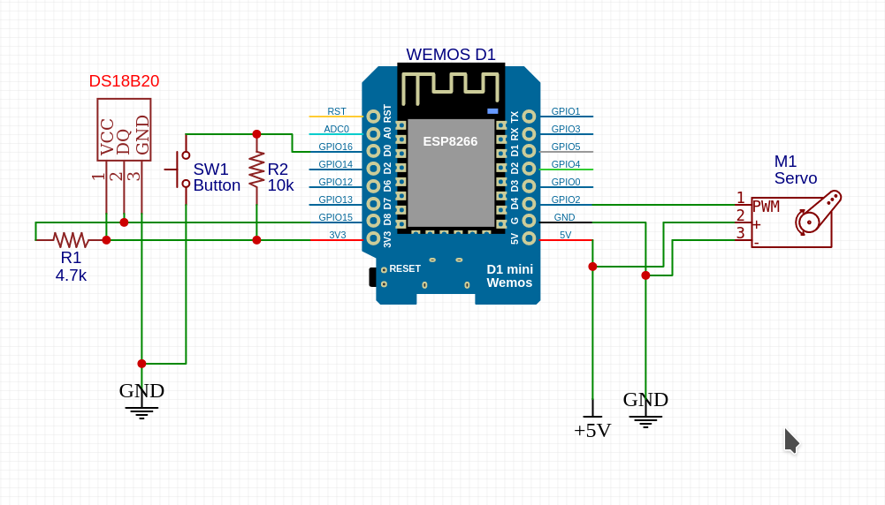
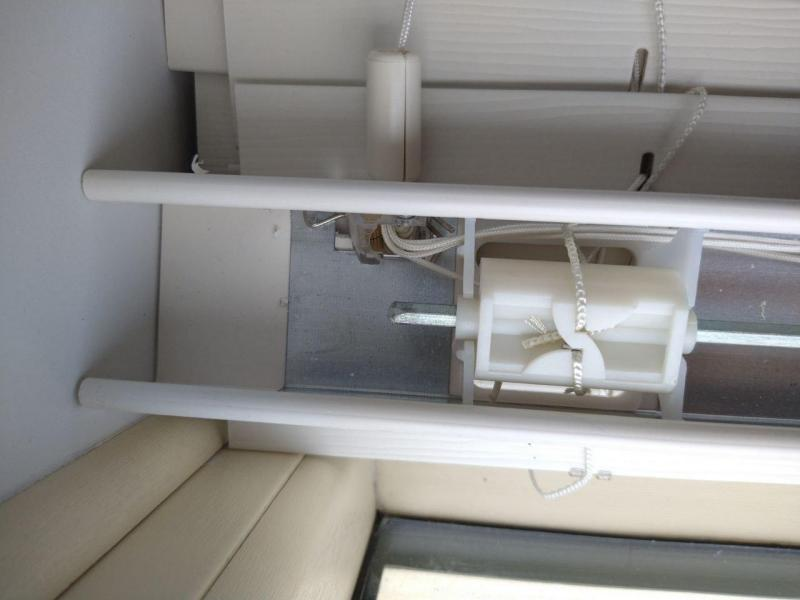
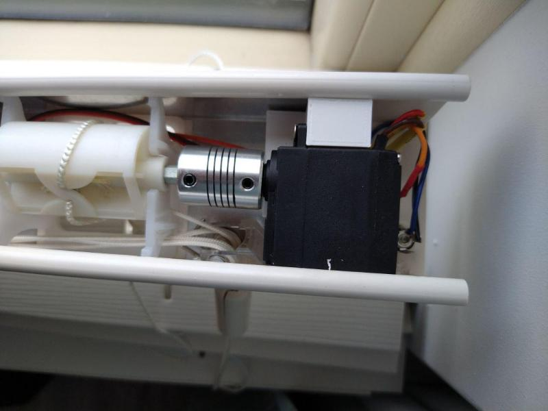
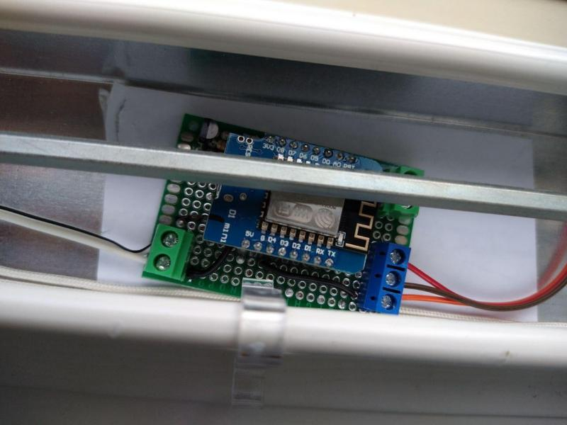
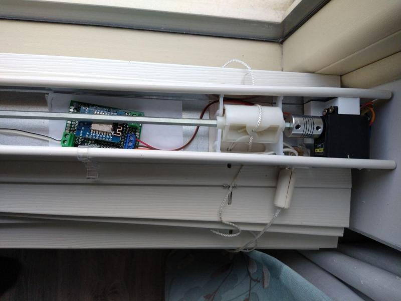
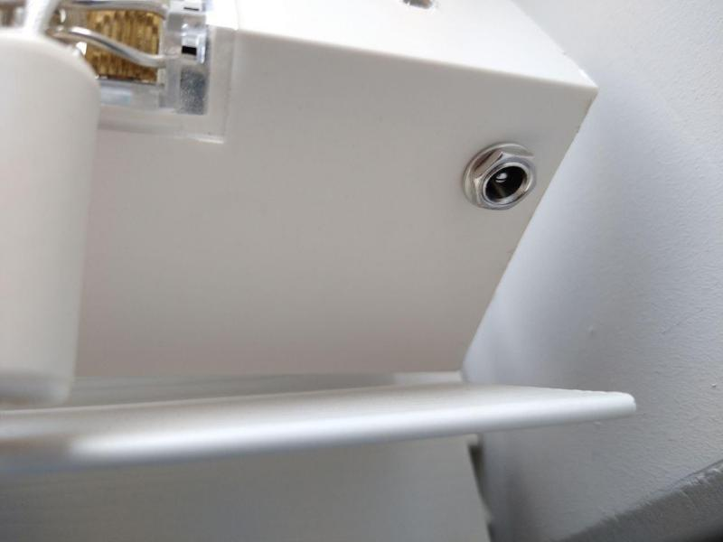

# Smart blinds

This is a small tutorial about how I made my dummy blinds smart.

You would need:

## Hardware

- Dummy blinds first of all! :)
- 1x any esp8266/32 board (I have used wemos D1 mini)
- 1x Servo (metal gear only!) I have used MG996R (make sure you have the 180/360 degree servo)
- 1x 3d printed servo 'holder' (you will have to do it yourself to match your needs)
- 1x 5mm-8mm Servo shaft coupler (check your blind and servo shaft for the exact dimmension)
- 5V 2A+ power supply

Optional:

- 1x push button
- 1x 10k resitor
- 1x ds18b20 digital thermometer
- 1x 4.7k resistor
- 3x screw terminals
- 1x power terminal

## Software

- EspHome (latest version)
- Homeassistant

## Schematic diagram

## How to assamble

- Bare metal blinds
  

- Couple the servo
  

- Add the controler
  

- Wire everything
  

- Plug the power on!
  

## Flashing time
[Here is an example of my EspHome config that works with Homeassistant](./smart-blind.yaml)
